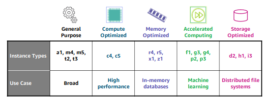
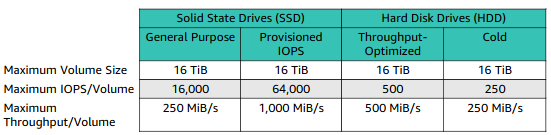
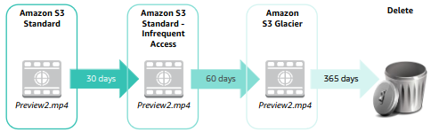
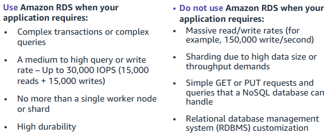
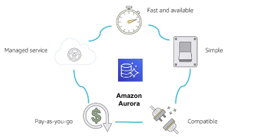
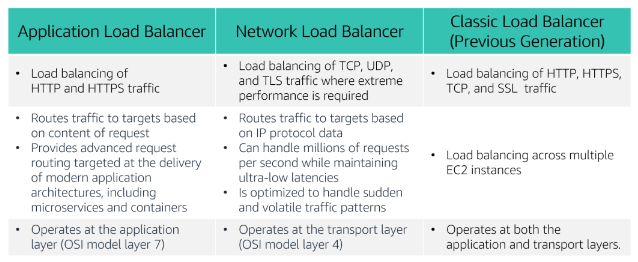
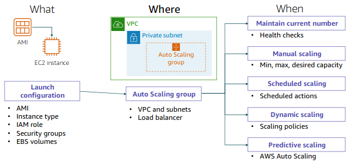

# Module 1

Cloud computing is the on-demand delivery of IT resources via the internet with a *"pay-as-you-go"* pricing.

Almost anything you can implement with traditional IT can be implemented as an AWS cloud computing service.

## 

## Cloud service models

* IaaS **"Infrastructure as a service"** \
    networking features, Hw or VMs and data storage space
* PaaS **"Platform as a service"** \
    no need to manage the underlying infrastructure Hw or Sw
* SaaS **"Software as a service"** \
    products that we can use (end-user applications)

## 

## Cloud computing deployment models

* **Cloud** \
    all the parts of the application run in the cloud, can be built using low-level infrastructure pieces or higher-level services that provide abstraction from management, architecting and scaling requirements of core infrastructure

* **Hybrid** \
    allows organizations to extend and grow their infrastructure into the cloud while connecting cloud resources to internal systems
    "usually between the cloud and existing on-premises infra"

* **On-Premises** \
    "private cloud", provides dedicated resources using virtualization ans resource management tools

---------------------------------

#### Similarities between AWS and traditional IT

* AWS security groups, network ACLs, AWS identity and IAM >< firewalls, ACLs and administrators
* Elastic load balancing, Amazon VPC >< routers, network pipelines and switches
* AMIs and Amazon EC2 >< On-Premises servers
* Amazon EBS, Amazon EFS, Amazon S3 and Amazon RDS >< DAS, SAN, NAS and RDBMS  

-------------------------------------------

## What's AWS?

**AWS** is a "secure cloud platform" that offers a broad set of global cloud-based products, offers <u>flexibility</u>, provides <u>on-demand access to many IT resources</u> and <u>management tools</u>.

### 

### Simple example of a database application

Costumers send data to Amazon EC2 instances. \
EC2 servers batch the data and add an object per costumer to Amazon S3.  \
To build an index we can use a simple non-relational database like Amazon DynamoDB. \
We can run these services inside an Amazon Virtual Private Cloud (VPC).

### 

### Services

* **EC2** , control over your AWS computing resources

* **Lambda**, run code without caring about servers maintenance

* **Elastic Beanstalk**, deploy, manage and scale web applications

* **Lightsail**, lightweight cloud platform for simple web applications

* **Batch**, manage and run hundred of thousands of batch workloads

* **Outposts**, run AWS infrastructure in your On-Premises data center

* **ECS**, "elastic *container* service"

* **EKS**, "elastic *kubernetes* service"

* **Fargate**, implement a containers or *microservice* architecture

* **VMware cloud**, migrate to AWS your On-Premises server virtualization platform

### 

### Interact with AWS

* **Management console**, graphical interface present on AWS

* **Command line interface**, command script that can be used locally

* **SDKs**, packages to access AWS

-------------------------------

## AWS Cloud Adoption Framework

**AWS CAF** provides guidance and best practices to help organizations build a cloud computing architecture across the organization and throughout the IT lifecycle.

### 

### Perspectives

* **Business** \
  Stakeholder from the business perspective can use the CAF to create a strong business case for cloud adoption.

* **People** \
  CAF can be used to evaluate organizational structures and roles, new skills and process requirements and identify gaps.

* **Governance** \
  Focus on the skills and processes that are needed to align IT strategy and goals with business strategy and goals.

* **Platform** \
  CAF includes principles and patterns for implementing new solutions on the cloud, and for migrating On-Premises workload to the cloud.

* **Security** \
  CAF allows to structure the selection and implementation of security controls that meet the organization's needs.

* **Operations** \
  Define current operation procedures, in order to identify the process changes and training that are needed to implement successful cloud adoption.

-----------------------

--------------------

# Module 2

Pay only for the services that you consume, there are many ways to pay less, you can use **Reserved Instances** (bundle-like): *AURI, PURI and NURI*.

There are also many "Volume-based" discounts, based on the usage increase.
For example S3 pricing is tiered, so you pay less per GB when you use more.

There are 3 fundamental drivers of cost with AWS:

* **compute** charged per hr/sec, varies by instance type

* **storage** charged per GB

* **data transfer** charged per GB

----------------

#### AWS Free tier

[Free AWS cloud services](https://aws.amazon.com/it/free/?all-free-tier.sort-by=item.additionalFields.SortRank&all-free-tier.sort-order=asc&awsf.Free%20Tier%20Types=*all&awsf.Free%20Tier%20Categories=*all)

-----------------

### Services with no charge

* **VPC**

* **IAM**

* **Automatic scaling**

* **Elastic beanstalk**

* **CloudFormation**

* **OpsWorks**

-----------------

### On-Premises Vs Cloud

The difference between these two is how they are deployed.

- *On-Premises* infrastructure is installed <u>_locally_</u> on a company's own computer and servers.
  
  * **fixed costs / capital expenses** like facilities, hardware, licenses and maintenance
  
  * **difficult to scale**
* *Cloud* infrastructure is purchased from a service provide, so there are <u>no capital expenses</u>  and there are costs only for new tools or upgrade (scaling).

#### 

#### Total cost of Ownership (TCO)

Is the financial estimate to help identify *direct* and *indirect* costs of a system.

It's useful to **compare** the costs of running an entire infrastructure environment or specific workload on AWS or using an On-Premises solution.

Can be a good indicator to **budget** and build the business case for moving to the cloud.

##### 

##### Parameters:

* **Server costs**

* **Storage costs**

* **Network costs**

* **IT labor costs**

----------------

### AWS pricing calculator

Helps you to estimate a <u>monthly</u> AWS bill, identify opportunity for cost reduction, model your solution before building them and explore price points and calculations.

https://calculator.aws/#/

#### 

#### Cloud total cost of Ownership (CTCO)

Defines what will be spent on the technology after adoption, or what it costs to run the solution. Different from TCO, because Total cost of Ownership is used for On-Premises solutions.

##### 

##### Parameters:

* **soft saving**, reuse service or applications, increase developer productivity, *Agile* business processes and increase global reach

* **hard savings**, reduce server costs, storage costs, network costs and personnel

------------------------

## AWS organizations

Is a free account management service that enables you to consolidate multiple AWS accounts into an **organization** that you create and manage.

#### 

#### Teminology

* **Organization units** (OU), are containers for accounts that can contain other OUs. We can define different <u>policies</u> for OUs or Accounts, each policy will affect all the children.

#### 

#### Organization utilities

* **Service control policies** (SCPs), allows to control AWS services across multiple AWS accounts, **<u>this does not replace IAM</u>**

* **Account groups**, OUs

* **Single payment system**, we can pay a single bill for all the accounts

* **API** to manage and control accounts

You can see more about "Setup an organization" and "IAM simulator" [here](https://docs.aws.amazon.com/IAM/latest/UserGuide/access_policies_testing-policies.html)

------

-----

# Module 3

AWS Cloud infrastructure is built around **Regions**, there are 22 regions worldwide. An AWS Region is a physical geographical location with one or more *Availability zone* (data centers).

A business can replicate data across Regions, this decision is based on data governance and legal requirements. It is important to consider the **latency**, you can use [this](https://www.cloudping.info/).

## 

## AWS foundational services

* **compute**
  
  - **EC2**, acts as virtual machines in the cloud.
  
  - **EC2 autoscaling**, allows to create or remove EC2 instances.
  
  - **ECS**, is a powerful *container-orchestation* service that supports Docker containers.
  
  - **ECR**, is a *Docker container registry*, to easily store, manage and deploy Docker container images.
  
  - **Ekastic beanstalk**, allows to deploy ans scale web applications ans services, using *Apache* and *Microsoft IIS*.
  
  - **Lambda**, allows to *run code* without managing servers, you pay only for the compute time.
  
  - **EKS**, make it easy to deploy, manage and scale, containerized applications that use *Kubernetes*.
  
  - **Fargate**, allows to run containers (ECS) without having to manage servers or clusters.

* **networking**
  
  * **VPC**, enables you to provision logically isolated sections of the AWS Cloud.
  
  * **Elastic load balancing**, distribuites incoming application traffic across multiple targets.
  
  * **CloudFront**, is a fast *content delivery service* (CDN).
  
  * **Transit gateway**, allow to connect *VPCs with On-Premises networks*.
  
  * **Route 53**, is a *DNS* service.
  
  * **Direct connect**, allows to create a *dedicated private network connection* from your data center to AWS.
  
  * **VPN** from your network or device to the AWS global network. 

* **security, identity and compliance**
  
  * **IAM**, manages access to AWS services and resources securely, allows to *create and manage AWS users and groups*.
  
  * **Organizations**, restricts what services and actions are allowed in your accounts.
  
  * **Cognito**, *add sign-up sign-in* to your mobile or web applications.
  
  * **Artifact**, provides an on-demand access to AWS security and compliance reports.
  
  * **KMS**, create and manage keys. *Encryption* across AWS services.
  
  * **Shield**, is a managed *DDoS protection* for applications on AWS.

* **storage**
  
  - **S3**, used for any amount of data, usually for websites, mobile apps, backup and restore, archive, enterprise applications, IoT and big data analytics
  
  - **EBS**, used for relational and non-relational databases, containers, big data analytics engines, file systems and media workflows.
  
  - **EFS**, used to scale demand to *petabytes*, provides an *elastic network file system* (NFS) to use with AWS cloud services and On-Premises  resources.
  
  - **Simple storage service Glacier**, for archiving *long-term backups*.

* **database**
  
  * **RDS**, allows to create, operate and scale *relational databases*.
  
  * **Aurora**, is a *MySQL* and *PostgreQL* compatible relational database (more efficient and speedy).
  
  * **Redshift**, allows to run *analytic queries on petabytes of data* in Redshift, against *exabityes of data* on S3.
  
  * **DynamoDB**, is a *key-value* and *document* database, with backup and restore, and in-memory caching.

-----------------

----------------

# Module 4

### Service characteristics and security responsibility

Every service intended as **IaaS**, for example *EC2*, *<u>require the customer to perform all the necessary security configuration and management tasks</u>*. For every **PaaS** instead it is not required.

For best practices for running a *Oracle Database* see [this](https://docs.aws.amazon.com/whitepapers/latest/oracle-database-aws-best-practices/oracle-database-aws-best-practice.html).

In short we can say that AWS is responsible for security **of** the cloud, instead the user is responsible for the security **in** the cloud.

## 

## AWS Identity and Access management (IAM)

Allows you to control access to compute, storage, database, and application services in the AWS Cloud. IAM can be used to *handle authentication*, and to specify or enforce *authorization policies*, in order to specify which user can access which service.

**Best practice:** <u>follow the principle of least privilege</u>

#### 

#### Fine-grained access rights

- **who** can access the resource

- **which** resource can be accessed and what can the user do whit it

- **how** resources can be accessed

#### 

#### Components

* **user**, person or application that can authenticate with an AWS account

* **group**, a collection of IAM users that are granted identical authorization

* **policy**, a document that defines *which resource can be accessed + level od access*

* **role**, mechanism to grant a set of permissions

#### 

#### Authenticate as a IAM user to gain access

When we define an IAM user, we define also the *types of access*.

A user can access using **Programmatic access** (API) using <u>access key ID</u> and <u>secret access key</u>. Or can access using a "login page" called **Management console access** using <u>12-digit account ID / alias</u> and <u>IAM username + IAM password</u>.

We can also add **IAM MFA** to increase the security.

#### 

#### Policies

* **Identity-based**, attach a policy to any IAM entity (user/group/role), listing all the actions an entity can or cannot perform; a single policy can be attached to multiple entities and every entity can have multiple policies.

* **Resource-based**, attached to a resource, for example S3 bucket.

You can access the IAM Policy simulator [here](https://policysim.aws.amazon.com/).

#### 

#### Securing a new AWS account

The ROOT account used to create and manage all the services used in AWS cannot be limited by policies, so we need to secure it in different ways. To secure the account, we must use it all if <u>strictly necessary</u>, allow the <u>MFA</u> for the account, activate <u>CloudTrail</u> to track user activity and keep an eye on the <u>billing reports</u>.

--------------

## AWS compliance programs

Provide information about the policies, processes and controls that are established and operand by AWS. We can use tools like **AWS config** to assess, audit and evaluate the configurations of AWS; also **AWS artifact** can be used to see security and compliance reports.

-------------------------------

---------------

# Module 5

## Networking basics

A computer network is composed by two or more clients machines that are connected together, can be logically partitioned into *subnets*.

Each machine in a network has a unique IP address, that can be *32-bit* long **IPv4** of *128-bit* long **IPv6**

#### 

#### Classless Inter-Domain routing (CIDR)

A CIDR address is composed by:

* **IP** address

* **/** "slash character"

* **number**, tells you how many bits of the routing prefix must be fixed or allocated for the network identifier

Is a way to express a group of IP addresses that are consecutive to each other. There are two special types:

* *Fixed IP addresses*, for example `192.0.2.0/32` represents a single IP address, this can be useful when you want to set up a firewall rule

* *The internet*, in which every byte is flexible `0.0.0.0/0`

#### 

#### Open System interconnection model (OSI)

Is a conceptual model used to explain <u>how data travels</u> over a network.

| Layer        | #   | Function                                                            | Protocol/Address         |
| ------------ | --- | ------------------------------------------------------------------- | ------------------------ |
| Application  | 7   | Means for an application to access a computer network               | HTTP(S), FTP, DHCP, LDAP |
| Presentation | 6   | Ensures that the application layer can read the data and Encryption | ASCI, ICA                |
| Session      | 5   | Enables orderly exchange of data                                    | NetBIOS, RPC             |
| Transport    | 4   | Protocols to support host-to-host communication                     | TCP, UDP                 |
| Network      | 3   | Routing and packet forwarding (routers)                             | IP                       |
| Data link    | 2   | Transfer data in the same LAN network                               | MAC                      |
| Physical     | 1   | Transmission and reception of raw bitstreams                        | Signals                  |

-------------------

## Amazon Virtual private cloud (VPC)

Lets you provision a logically isolated section of the AWS Cloud where you can launch your AWS resources. 

* Selection of *IP address range*

* Creation of *subnets*

* Configuration of *route tables* and *network gateways*

#### 

#### VPCs

Every VPC is *logically isolated* from other VPCs, it is dedicated to your AWS account and belongs to a single AWS Region and can span across multiple Availability Zones

#### Subnets

*Range of IP addresses* that divide a VPC, belong to a single Availability Zone and can be *public* or *private*

#### IP addressing

When you create a VPC, you assign it to an **IPv4 CIDR block** (<u>range of private IPv4</u> addresses), this range cannot be changed. Every CIDR block can have a **max** size of `/16` and a **min** size of `/28`. CIDR blocks of subnets cannot overlap.

Use this [reference](https://docs.aws.amazon.com/vpc/latest/userguide/what-is-amazon-vpc.html).

* **reserved IP addresses**, for every CIDR block created, AWS reserves:
  
  * `x.x.x.0` network address
  
  * `x.x.x.1` internal communication
  
  * `x.x.x.2` DNS resolution
  
  * `x.x.x.3`  Future use
  
  * `x.x.x.255` network broadcast address

* **Elastic IP address**
  
  Every Elastic IP address is associated with an AWS account, can be *allocated* and *remapped* anytime.
  
  Use this [reference](https://docs.aws.amazon.com/vpc/latest/userguide/vpc-eips.html).

* **public IP address**
  
  Can be *manually assigned* through an Elastic IP address or *automatically* assigned through the auto-assign public IP address settings at the subnet level.

### 

### Elastic network interface

Is a *virtual network interface* that you can **attach** to an instance to redirect network traffic to it and **detach** it. Each instance in your VPC has a default network interface that is assigned a private IPv4 address from the IPv4 address range of your VPC.

Use this [reference](https://docs.aws.amazon.com/AWSEC2/latest/UserGuide/using-eni.html).

#### Route tables and routes

A route table contains a set of rules/routes that you can configure to direct network traffic from your subnet. Each rout specifies a destination and a target, by default every route table contains a *local route* for communication within the VPC. Each subnet must be associated with a route table (at most one).

Use this [reference](https://docs.aws.amazon.com/vpc/latest/userguide/VPC_Route_Tables.html).

--------------

#### Internet gateway

Is a scalable, redundant and highly available VPC components that allows communication between instances in your VPC and the internet. Allows to **provide a target** in yout VPC route table for internet-routable traffic and to perform **network address translation** for instances that were assigned IPv4 addresses.

Use this [reference](https://docs.aws.amazon.com/vpc/latest/userguide/VPC_Internet_Gateway.html).

### Network address translation (NAT) gateway

Enables instances in a private subnet to connect to the internet or other AWS services, but prevents the internet from initiating a connection with those instances. To create a NAT gateway, you must specify the *public subnet* in which the NAT gateway should reside. You must also specify an Elastic IP address to associate with the NAT gateway, after you must update the route table that is associated with one or more of your private subnets to point inter-bound traffic to the NAT gateway.

* NAT [gateways](https://docs.aws.amazon.com/vpc/latest/userguide/vpc-nat-gateway.html)

* NAT [instances](https://docs.aws.amazon.com/vpc/latest/userguide/VPC_NAT_Instance.html)

-----

## VPC sharing

The account that owns the VPC **(owner)** shares one or more subnets with other accounts **(participants)** that belong to the same organization, the participants can *view*, *create*, *modify* and *delete* their application resources in the subnets that are shared with them.

Pros:

* Separation of duties

* Security groups

## 

## VPC peering

Is a networking connection between two VPCs that enables you to route traffic between them privately. Instances in either VPC <u>can communicate</u> with each other as if they are within the <u>same network</u>.

Restrictions:

* IP address ranges **cannot overlap**

* **transitive peering is not supported**

* **only one** peering resource between the same two VPCs

Use this for [reference](https://docs.aws.amazon.com/vpc/latest/userguide/vpc-peering.html).

--------

### AWS Site-to-Site VPN

By default, <u>instances that you launch into a VPC cannot communicate with remote network</u>.

To connect your VPC to your remote network we need to create a [VPN connection](https://docs.aws.amazon.com/vpc/latest/userguide/vpn-connections.html).

### AWS Direct connect

AWS offers this service to establish a dedicated, private network connection between your network and one of the [AWS Direct connect](https://aws.amazon.com/directconnect/) locations, so that we can reduce network costs, increase bandwidth throughput and provide a more consistent network experience than internet-based connections. 

This can be useful if your data center is located far away from your AWS Region.

### AWS Transit Gateway

For On-Premises connectivity you must attach your VPN to each individual VPC, this can be really hard and slow for many machines.

Using the transit gateway we only need to *create* and *manage* a single connection from the central gateway into each VPC.

----

## VPC endpoints

Is a *virtual device* that enables you to privately connect your VPC to supported AWS services and VPC endpoint services that are powered by AWS PrivateLink.

* **interface VPC endpoint**, enables you to connect to services that are powered by [AWS PrivateLink](https://docs.aws.amazon.com/vpc/latest/privatelink/create-interface-endpoint.html)

* **gateway endpoint**

## 

## VPC security

### Security group

Acts as a *virtual firewall* for your instance, and it controls **inbound** and **outbound** traffic. * ~"filter for traffic to your instances" *

Every security group has its *rules*, default groups **deny all <u>inbound</u> traffic** and **allow all outbound traffic**.

[<u>stateful</u>]

### Network access control lists (network ACLs)

Every VPC can have this additional layer of security, are rules that are similar to "Security groups", each subnet can have its ACL.

By default **inbound and outbound traffic is allowed**

[<u>stateless</u>]

Use this for [reference](https://docs.aws.amazon.com/vpc/latest/userguide/vpc-network-acls.html).

--------------------

## Amazon Route 53

Is a **Domain name system DNS** web service, is used to route end users to internet applications by translating names into numeric IP addresses. Connect user requests to infrastructure running in AWS and also outside, is used to check the health of your resources, features traffic flow and enables you to register domain names.

Supported routing:

* **Simple** routing, use in single-server environments

* **Weighted round robin** routing, assign weights to resource record sets to specify the frequency

* **Latency** routing, help improve your global applications

* **Geolocation** routing, route traffic based on location of the users

* **Geoproximity** routing, route traffic based on location of your resources

* **Failover** routing, fail over to a backup site if your primary site becomes unreachable

* **Multivalue answer** routing, respond to DNS queries with up to 8 healthy records selected at random

## 

## Amazon CloudFront

Is a **Content delivery network CDN** service, is a globally distributed system of caching servers, *caches* copies of commonly requested files (static content), *delivers* a local copy of the requested content from a <u>nearby cache edge</u> (Point of Presence) and improves application performance and scaling.

* **fast and global**

* **security at the edge**

* **highly programmable**

* **cost-effective**
  
  Pricing:
  
  * *data transfer out* = <u>volume of data transferred out</u>
  
  * *HTTP(S) requests* = <u>#HTTP(S) requests</u>
  
  * *Invalidation requests* = after inval_req > 1000 $0.005 per path
  
  * *Dedicated IP custom SSL* = $600 per month

--------------------------

----------------------

# Module 6

## Amazon EC2

Provides virtual machines where you can host the same kinds of applications that you might run on a traditional On-Premises server. **Elastic compute cloud** dives you full control over the *guest OS (Win/Linux)* on each instance, every instance can have a specified size into an Availability Zone. You can launch instances from **AMIs** and you can also control traffic *to* and *from* instances.

### Amazon machine image (AMI)

Provides information that is required to launch an EC2 instance, every instance need an AMI, you can use different AMIs for different types of instances.

Is composed by: **template for the root volume** of the instance (OS), **launch permissions** to control which AWS account can use the AMI and **block device mapping** that specifies the volume to attach to the instance.

**Types:**

* **Quickstart**, Win/Linux AMIs provided by AWS

* **My AMIs**, AMIs created by the user

* **Community AMIs**, AMIs shared by others

* **AWS Marketplace**, pre-configured templates from third parties

More info about different [types](https://aws.amazon.com/ec2/instance-types/)

When you have more EC2 instances, you can use **placements groups** to specify a placement criteria, for example "*deploy all the instances in the same Availability Zone*".

-----

#### Network settings

You have to choose where you want to deploy the instance, selecting the *Region* of interest; Every time you launch an instance it will have a *default <u>VPC</u>*, AWS will assign a public IP address. You can also choose to launch the instance into a **nondefault VPC**.

**Elastic IP address**

Every time we stop or terminate an instance a new IP address we be associated/used by the instance. If we want to have the same IP address we must associate an *Elastic IP address*.

-----

#### Attach IAM role [optional]

In order to make secure API calls to other AWS services you need to attach an *AWS Identity* and *IAM role* to the EC2 instance.

#### User data scripts [optional]

We can specify a *user data script* at instance launch, so that we customize the runtime environment of the instance. Ususally are Linux bash shell scripts or command for the Command Prompt window/Windows PowerShell.

[This](https://aws.amazon.com/premiumsupport/knowledge-center/execute-user-data-ec2/) is an example.

----

#### Specify storage

We can configure storage options, we can choose a **root volume** where the guest OS is installed, we can also attach additional storage volumes.
For each volume we must specify:

- Size of the disk in GB

- Volume type (type of SSDs or HDDs)

- Auto-deletion on terminate

- Encryption used 

#### 

#### Storage options

* **Elastic Block Store (EBS)**
  
  Is an high-performance durable block storage service that is designed for both *throughput* and *transactions-intensive* workload

* **EC2 Instance Store**
  
  Ephemeral or temporary block-level storage for the instance. Are located to the physical disk used by the instance, used for *temp data* such as buffers, caches, scratch data and others

* **Elastic File System (EFS)**
  
  Fully managed elastic *Network File System (NFS)*, built to scale on-demand to petabytes, it grows and shrinks automatically

* **Simple Storage Service (S3)**
  
  Object storage service that offers scalability, data availability, security and performance; useful for websites, mobile apps, backup and restore, archive, enterprise applications, IoT and big data analytics

---

#### Tags

Are label assigned to an AWS resource, *KEY* and optional *VALUE*, in this way we can attach <u>metadata</u> to an EC2 instance, to easy filter, automate, control cost allocation and select specific access control.

---

#### Security group settings

Is a *set of firewall rules* that control traffic to  and from the instance, we can specify the *source* and which *port* that network communication can use.

---

#### Key pair (SSH connections)

You can manage and create Key pair of **PublicKey** stored by AWS and **PrivateKey** file that you store (.pub). This enables secure connections to the instance.

------

### Amazon CloudWatch

We can monitor EC2 instances, using *near-real-time* metrics and using the charts provided by the *Monitoring Tab*; up to 15 months of historical data.

* **basic monitoring**
  
  no additional cost, updated every 5 minutes

* **detailed monitoring**
  
  fixed monthly rate for 7 pre-selected metrics, every 1 minute

Use this for [reference](https://docs.aws.amazon.com/AWSEC2/latest/UserGuide/using-cloudwatch-new.html).

----

### Pricing models

* **On-Demand instances**
  
  Pay by the <u>hour</u>, no long-term commitments but eligible for [Free tier](https://aws.amazon.com/free/)

* **Dedicated hosts**
  
  Physical server with EC2 instance capacity full dedicate to your use

* **Dedicated instances**
  
  Instances that run in a VPC on hardware dedicated to a single costumer

* **Reserved instance**
  
  You can reserve computing capability for *1-year or 3-year term with hourly running cost*

* **Scheduled Reserved Instances**
  
  You can purchase capacity reservations that recur on a daily, weekly, or monthly basis whit a specified duration for a 1-year term

* **Spot instances**
  
  Allows you to bid on unused EC2 instances, which can lower the costs; the *hourly price for a spot instance depends on supply and demand*

---------

## Container services

#### What's a container?

Containers are a method of *operating system virtualization*, it is repeatable, self-contained environment, software runs the same in different environments and it is faster to launch, stop or terminate than a VM. Containers are created from *"templates"* called image.

#### What is Docker?

Is a software platform that enables you to build, test, and deploy applications quickly; we can run containers in Docker.

### Elastic Container Service (ECS)

It's an highly scalable, fast, container management service. Can *orchestrate* the running Docker containers, maintain and scale the fleet of nodes that run your containers and removes the complexity of standing up the infrastructure.

To use ECS we need to create a  **task definition** that is a text file that describes one or more containers, up to a  maximum of 10, specifies also the parameters for your application.

A **task** is the instantiation of a task definition within a cluster, every cluster can run more tasks. **ECS task scheduler** places tasks within the cluster, every **ECS cluster** consists of a group of EC2 instances each of which is running a **ECS container agent**.

#### Cluster options

When we create an ECS Cluster we can choose to create:

* **Networking Only** cluster, powered by AWS Fargate, the cluster will be managed by  AWS, in this way we only need to package the application in containers, specify the CPU and memory requirements , define networking and IAM policies and launch the application.

* **EC2 Linux/Windows + networking cluster**, we must choose to run as an *On-Demand instances* or *Spot instances*, we need to specify many details about the EC2 instances.

### 

### Elastic Container registry (ECR)

Is a fully managed Docker container registry that makes it easy for developers to store, manage and deploy Docker container images.

------

#### What is Kubernetes?

It's an open source software for *container orchestration*, enables to deploy and manage containerized applications at scale. We can run any type of containerized application using the same toolset in both On-Premises data centers and the cloud. Containers are run in logical groupings called **pods**, each pod has an IP address and a single Domain Name System (DNS), which Kubernetes uses to connect to services with each other and external traffic.

### Elastic Kubernetes Service (EKS)

Is a managed Kubernetes service that makes it easy to run Kubernetes on AWS without need to install, operate and maintain your ow Kubernetes control pane. Supports Linux/Windows containers, supports many add-ons. 

-----------

## AWS Lambda

Supports many programming languages, has a completely automated administration, has an high built-in fault tolerance, supports orchestration of multiple functions and has a *pay-per-use* pricing.

#### Event source

Produces events that trigger an AWS Lambda function to run. Lambda can also **pull** records from an Amazon Simple queue service (SQS) queue and run a Lambda for each fetched message; Lambda can also read events from Dynamo DB.

Use this for [reference](https://docs.aws.amazon.com/lambda/latest/dg/lambda-services.html).

#### Function configuration

Every Lambda function has a **name**, **runtime environment** (for example python/node) and an **execution role** to grant IAM permissions so that we can interact with other AWS services. After the initial configuration we must add a code to be executed, a trigger, the memory required and if necessary we can also setup environment variables.

---------

## Elastic Beanstalk

It's a PaaS that falicitates the quick *deployment*, *scaling* and *management* of your web applications and services. You only need to upload your code, choose the instance type, the database to use, set and adjust automatic scaling, update your application, access the server log files and enable HTTPS on the load balancer.

You pay only for the underlying resources that are used.

#### Deployments

Supports web applications written in *Java*, *.NET*, *PHP*, *Node.js*, *Phyton*, *Ruby*, *Go* and *Docker*, it deploys on servers such as Apche, NGINX, Passenger, Puma and Microsoft Internet Information Services.

--------

--------

# Modeule 7

## Elastic Block store (EBS)

Provides persistent block storage volumes for use with EC2 instances. Persistent storage is any data storage device that retains data after power to that device is shut off [**non-volatile storage**]. Every EBS volume is automatically replicated within its Availability Zone.

Allows to create **point-in-time snapshots** of your volumes, and you can *re-create* a new volume from snapshot at any time. You can also propagate snapshots to different AWS Regions. You can also **encrypt** at no additional cost.

 Types:

Use this for [reference](https://docs.aws.amazon.com/AWSEC2/latest/UserGuide/ebs-volume-types.html).

----

## Simple Storage service (S3)

Is an *object-level* storage, which means that if you want to change a part of the file, <u>you must make the change and then re-upload the entire modified file</u>. Data are stored as objects within resources that are called **buckets**.

When we create a bucket, it is associated with a *specific AWS Region*, when we store data in the bucket, it is **redundantly stored across multiple AWS facilities**.

Use this for [reference](https://aws.amazon.com/s3/).

**Storage classes**:

* **standard**, designed for high durability, availability and performance object storage for *frequently accessed data*

* **intelligent-tiering**, designed to optimize costs by automatically moving data to the most cost-effective access tier, without performance impact or operational overhead; requires a small *monthly monitoring and automation fee per object*

* **standard-infrequent access** (Standard-AI), is used for data that is accessed less frequently, but requires rapid access when needed.

* **one zone-infrequent access** (One Zone-AI), same as standard-AI but only for 1 Availability zone

* **glacier**, it is a low cost solution, with 3 different retrieval options that range from a few minutes to hours

* **glacier deep archive**, low cost solution, allows long-term retention and digital preservation of data for data that can be accessed one or twice in a year

Use this for [reference](https://docs.aws.amazon.com/AmazonS3/latest/dev/storage-class-intro.html).

#### URL styles

When we upload our data, we *create* a bucket in an AWS Region and we can load *objects* to the bucket.

* *Bucket path-style endpoint*
  
  `https://s3.ap-northeast-1.amazonaws.com/bucket-name`
  
  With Region code and after the Bucket name

* *Bucket virtual hosted-style endpoint*
  
  `https://bucket-name.s3-ap-northeast-1.amazonaws.com`
  
  With Bucket name and after Region code

----

## Elastic File System (EFS)

It is a simple, scalable, elastic file system for use with AWS services and On-Premises resources. It is designed to automatically grow and shrink.

Works well for big data and analytics, media processing workflows, content management, web serving and home directories.

#### Resources

In the EFS, a file system is the primary resource, each file system has:

* **ID**

* **Creation token**

* **Creation time**

* **File system size** in bytes

* Number of <u>**mount targets**</u> that are created for the file system
  
  Mount targets are required to access the file system, we must associate mount target in the VPC, is composed by:
  
  * mount target ID
  
  * subnet ID for the subnet where it was created
  
  * file system ID for the file system where it was created
  
  * IP address where the file system can be mounted
  
  * mount target state

* **File system state**

* **Tags**
  
  Useful to organize your file system, you can assign your own *metadata* to each of the file systems that you create [*KEY-VALUE* pair]

---

## S3 Glacier

Is a *data archiving service* that is designed for security, durability andd extremely low cost. That stored inside glaciers can take <u>several hours to be retrieved</u>.

Every glacier is composed by:

* **Archive**, any object that you store in S3 Glacier, it is the *base unit* of storage with an ID and a description

* **Vault**, container for storing archives, has a name and the Region where you want locate the vault

* **Vault access policy**, determine who *can* and *cannot* *access* data that is stored in the vault, and what *operation can* or *cannot* do

-------------

### Lifecycle policies

Enable you to delete or <u>move objects based on age</u>.

Use this for [reference](http://docs.aws.amazon.com/AmazonS3/latest/dev/object-lifecycle-mgmt.html).

---

----

# Module 8

## Unmanaged services

Are typically provisioned in discrete portions as specified by the user, <u>you must manage how the service responds to changes in load, errors and situations where resources become unavailable</u>.

The benefit to using an unmanaged service is that you have more fine-tuned control over how your solution handles changes in load, errors and situations where resources become unavailable.

## Managed services

Require the user to configure them, require less configuration than *Unmanaged services*. Have good features such as scaling, fault-tolerance and availability, <u>handled automatically and internally by AWS</u>.

---

## Relational Database service (RDS)

Is a **managed** service that sets up and operates a relational database in the cloud. You only manage the application optimization, instead AWS manages installing and patching the OS, the database software, automatic backups and availability.

AWS also scales resources, manages power and servers, and performs maintenance.

### Database instance

Is an isolated database environment that can contain *multiple user-create databases*. The resources in a database instance are determined by its database instance class, and the type of storage is dictated by the type of disks.

### RDS in a virtual private cloud (VPC)

Usually the database is isolated in a *private subnet* and is only made directly accessible to indicated application instances. Keep in mind that when you select the subnet, you are also choosing the *Availability Zone* for your database instance.

#### Multi-AZ deployment

Can be configured to **automatically generate a standby copy** of the database instance in another *Availability Zone* within the same VPC. Transaction are synchronously replicated to the standby copy. Therefore, if the main database instance fails, *Amazon RDS* automatically brings the standby copy online.

### Read replicas

*RDS* supports the creation of read replicas for *MySQL*, *MariaDB*, *PostgreSQL* and *Amazon Aurora*. <u>Updates that are made to the source database instance are asynchronously copied to the read replica instance</u>. In this way you can **reduce the load** on your source database. Read replicas can be created in a different Region than the primary database.

---

## Relational databases

**RDB** works with structured data that is organized by tables, records, and columns. There are well-defined relationship between database tables. **SQL** (Structured query language). Relational databases <u>might</u> have difficulties scaling out horizontally or working with semistructured data, and <u>might</u> also require many joins for normalized data.

## Non-Relational databases

Is any database that does not follow the relational model. They can scale out horizontally, and they can work with unstructured and semistructured data.

---

## DynamoDB

Is a fast and flexible **NoSLQ** database for all applications that need consistent, single-digit-millisecond latency at any scale. Amazon manages all the underlying data infrastructure for this service and redundantly stores data across multiple facilities in a native *US Region* as part of the fault-tolerant architecture. Items in the same table can have different attributes. Can have global tables that enable you to <u>automatically replicate across AWS Regions, encryption at rest and item TTL</u>.

#### Components

A DynamoDB have **tables** that are collections of data, **items** group of attributes that is uniquely identifiable and **attributes**. 

**Primary keys**:

* **partition key**, composed by a single attribute called *sort key*

* **composite primary key**, composed by more attributes 

Use this for [reference](https://docs.aws.amazon.com/amazondynamodb/latest/developerguide/HowItWorks.CoreComponents.html#HowItWorks.CoreComponents.TablesItemsAttributes).

#### Partitioning

As data grows, table data is partitioned and indexed by the primary key. You can retrive data from DynamoDB table in 2 different ways:

* *query operation* takes advantage of partitioning to effectively locate items by using the primary key

* *scan*, which enables you to locate items in the table by matching conditions on non-key attributes

----

## Redshift

Is a fully managed **data werehouse** that makes it simple and cost-effective **to analyze** all your data by using standard *SQL* and your existing business intelligence tools.

Allows to run complex analytic queries against <u>petabytes</u> of structured data.

### Parallel processing architecture

The leader node manages communications with client programs and all communication with compute nodes. It parses and develops plans to carry database operations for all the steps required to obtain results for complex queries. <u>The compute nodes run the compiled code send intermediate results back to the leader node for final aggregation</u>.

---

## Aurora

Is a *MySQL* and *PostgreSQL* **compatible relational database** that is built for the cloud. As a fully managed service, Aurora is designed to automate time-consuming tasks like provisioning, patching, backup, recovery, failure detection an repair.

-------

--------

# Module 9

#### Cloud architects

Engage with decision makers to identify the business goal and the capabilities that need improvement, ensure alignment between technology deliverables of a solution and the business goals.

---------

## Well-Architected Framework

Is a **guide** that is designed to help you build the most secure, high-performance, resilient and efficient infrastructure possible for your cloud applications and workloads. Provides a set of <u>foundational questions</u> and <u>best practices</u> that can help you evaluate and implement your cloud architectures.

Use this for [reference](https://d1.awsstatic.com/whitepapers/architecture/AWS_Well-Architected_Framework.pdf).

### Pillars

* **Operational Excellence** focuses on the ability to *run and monitor systems* to deliver business value, and to continually improve supporting processes and procedures.
  
  Design principles:
  
  * *<u>Perform operations as code</u>*, define your workload as code and update it
  
  * *<u>Make frequent, small, reversible changes</u>*, design workloads to enable components to be updated regularly
  
  * *<u>Refine operations procedures frequently</u>*, look to opportunities to improve operations procedures
  
  * *<u>Anticipate failure</u>*, identify potential sources of failure so that they can be removed or mitigated
  
  * *<u>Learn from all operational failures</u>*, drive improvement through lessons learned from all operational events and failures
  
  

* **Security** focuses on the ability to *protect information, systems, and assets* while delivering business value through risk assessments and mitigation strategies.
  
  Design principles:
  
  * *<u>Implement a strong identify foundation</u>*, implement the principle of **least privilege** and enforce **separation of duties** with appropriate authorization for each interaction with your AWS resources
  
  * *<u>Enable traceability</u>*, monitor, alert actions and changes to your environment in real time
  
  * *<u>Apply security at all layers</u>*, apply defense in depth and apply security controls to all layers of your architecture
  
  * *<u>Automate security pest practices</u>*, to improve your ability to securely scale more rapidly and cost effectively
  
  * <u>*Protect data in transit and at rest*</u>, classify your data into **sensitivity levels** and use mechanism such as encryption, tokenization and access control where appropriate
  
  * *<u>Keep people away from data</u>*, to reduce the risk of loss or modification of sensitive data due to human error
  
  * *<u>Prepare for security events</u>*

* **Reliability** focuses on ensuring a workload performs its intended *function correctly and consistently* when it's expected to.
  
  Design principles:
  
  * <u>*Automatically recover from failure</u>*, monitor system for key performance indicators and configure your system to trigger an automated recovery
  
  * <u>*Test recovery procedures*</u>, test how your systems fail and validate your recovery procedures
  
  * *<u>Scale horizontally to increase aggregate workload availability</u>*
  
  * *<u>Stop guessing capacity</u>*, monitor demand and system usage, and automate the addiction or removal of resources
  
  * *<u>Manage change in automation</u>*, use automation to make changes to infrastructure and manage changes in automation

* **Performance Efficiency** focuses on the ability to *use IT and computing resources efficiently* to meet system requirements, and to maintain that efficiency as demand changes or technologies evolve.
  
  Design principles:
  
  * *<u>Democratize advanced technologies</u>*, consume technologies as a service, to allow team to focus on product development instead of resource provisioning and management
  
  * *<u>Go global in minutes</u>*, deploy systems in **multiple AWS Regions** to provide lower latency and better customer experience at minimal cost
  
  * *<u>Use serverless architectures</u>*, in order to remove the operational burden of running and maintaining servers to carry out traditional computing activities
  
  * *<u>Experiment more often</u>*, perform comparative testing in different types of instances, storage and configurations
  
  * *<u>Consider mechanical sympathy</u>*, use technology approach that aligns best to what you are trying to achieve

* **Cost Optimization** focuses on the ability to *avoid unnecessary costs*.
  
  Design principles:
  
  * *<u>Implement cloud financial management</u>*, to achieve financial success and accelerate business value realization in the cloud
  
  * *<u>Adopt a consumption model</u>*, pay only for the computing resources that you require
  
  * *<u>Measure overall efficiency</u>*, measure the business output of the workload and the costs that are associated with delivering it
  
  * <u>*Stop spending money on undifferentiated heavy lifting*</u>, don't waste money in racking, stacking and powering servers
  
  * *<u>Analyze and attribute expenditure</u>*, having this capability helps you measure return of investment (*ROI*)

---

## AWS Trusted Advisor

Is an online tool that provides real-time guidance to help you provision your resources following AWS best practices. Looks at the entire AWS environment and **gives you real-time recommendations** in 5 categories: *Cost optimization*, *Performance*, *Security*, *Fault tolerance* and *Service limits*.

Use this for [reference](https://docs.aws.amazon.com/awssupport/latest/user/trusted-advisor-check-reference.html).

----

---

# Module 10

## Elastic Load Balancing

Is an AWs service that **distributes incoming application or network traffic** across multiple targets in a *<u>single</u> Availability Zone* or *across <u>multiple</u> Availability Zone*.

Scales your load balancer as traffic to your application changes over time

Types:

Use this for [reference](https://aws.amazon.com/elasticloadbalancing/features/?nc=sn&loc=2).

To use a load balancer you need to register **targets in target groups**. Load balancer *performs health checks* to monitor health of registred targets.

You also need to specify one or more **listeners**, every listener is a process that checks for connection requests. It is configured with a <u>protocol and port number</u> for connections from load balancer to the targets

### Load balancer monitoring

* **CloudWatch metrics**, enables to retrieve statistics about data points as an ordered set of time series data, known as metrics. 
  
  You can also setup **alarms** based on static threshold, you choose a CloudWatch metric for the alarm to watch and the threshold for that metric.
  
  See this [example](https://docs.aws.amazon.com/AmazonCloudWatch/latest/monitoring/AlarmThatSendsEmail.html).
  
  

* **Access logs**, can be used to capture detailed information about the requests that were made to your load balancer and store them as log files.
  
  

* **CloudTrail logs**, can be used to capture detailed information about the calls that were made to the *Elastic Load Balancing* application programming interface *API* and store them as log files in *Amazon S3*.

----

## EC2 Auto Scaling

Is an AWS service that helps you maintain application availability and enables you to **automatically add or remove** *EC2* instances according to conditions you define. You can use *fleet management features* of EC2 Auto Scaling to maintain the health and availability of your fleet. 

You can also add or remove EC2 instances manually, on a schedule, in response to changing demand or in combination with AWS Auto Scaling for predictive scaling.

Use this for [reference](https://aws.amazon.com/ec2/autoscaling).

#### Auto Scaling groups

Are a collection of EC2 instances that are treated as a logical grouping for the purposes of automatic scaling and management. The size is specified as *desired capacity*.

You can specify the minimum number of instances in each Auto Scaling group, EC2 Auto Scaling is designed to prevent your group from going below the size or above the maximum size.

Use this for [reference](https://docs.aws.amazon.com/autoscaling/ec2/userguide/auto-scaling-groups.html).

How it works?

See more about [*launch configurations*](https://docs.aws.amazon.com/autoscaling/ec2/userguide/launch-configurations.html).

-------

Author: [Riccardo Ruberto](https://github.com/RiccardoRobb)
